# Enunt

O aplicație în care să ilustrați o serie de repartiții discrete și
continue (minim 15) și modul în care pot fi utilizate în calcul: astfel
pentru fiecare repartiție să aveți posibilitatea să selectați valorile
parametrilor care definesc repartiția, să ilustrați grafic densitatea
(respectiv funcția de masă) și funcția de repartiție, să calculați
probabilități de tipul $A = \mathrm{P}(X \le a), \mathrm{P}(X \ge b)$
sau $\mathrm{P}(a \le X \le b)$, pentru valori ale lui $a$ si $b$ date
si sa ilustrati grafic probabilitatea calculata prin hasurarea zonei
corespunzatoare.

## Afisare

Pentru toate elementele ce se afiseaza, mai putin sidebar, am folosit
box astfel: Avem doua sliders **Alpha** si **Beta**, valorile date de
ele(alpha\_, respectiv beta\_) o sa fie folosite pe parcurs la toate
distributiile care necesita/permit doua variabile. Vor fi preluate in
toate distributiile ca "a" si "b"(in variabilele a si b)

**oneParam** este folosit pentru distributiile care necesita doar un
parametru valoarea acestuia(alphaS\_) o sa fie preluata ca "a"(in
variabila a)

Avem cate un plot pentru: - functia de densitate - functia de
repartitie - functia de repartitie cu calculul probabilitatilor de
tipul:\
$A = \mathrm{P}(X \le a)$\
$\mathrm{P}(X \ge b)$\
$\mathrm{P}(a \le X \le b)$

```{r include=FALSE}
library(shiny)
library(shinydashboard)
library(ggplot2)
library(shinyjs)
library(r2symbols)
library(actuar) # pentru pareto
```

```{r interfata}
# Define the user interface
ui <- dashboardPage(
  dashboardHeader(),
  dashboardSidebar(
    #side-bar
    selectInput("dist", "Select a Distribution:", 
                c("Normal" = "norm", "Uniform" = "unif", "Exponential" = "exp", "Poisson" = "pois", "Binomial" = "binom", "Geometric" = "geom", "Gamma" = "gamma", "Beta" = "beta", "Chi-Squared" = "chisq", 
                  "F" = "f", "t" = "t", "Cauchy" = "cauchy", "Log-Normal" = "lnorm", "Weibull" = "weibull", "Pareto" = "pareto"))
    
  ),
  #Folosim box
  
  # Avem doua sliders "Alpha" si "Beta", valorile date de ele(alpha_, respectiv beta_) o sa fie folosite pe parcurs la toate distributiile care necesita/permit doua variabile
  # vor fi preluate in toate distributiile ca "a" si "b"(in variabilele a si b)
  
  # oneParam este folosit pentru distributiile care necesita doar un parametru
  # valoarea acestuia(alphaS_) o sa fie preluata ca "a"(in variabila a)
  dashboardBody(
    useShinyjs(),
    hidden(
      div(id = "alphaBeta", 
          box(
            title = "Alpha",
            sliderInput("alpha_", "alpha_", 0.1, 1, 0.1)
          ),
          div(id = "onlyBeta",
            box(
              title = "Beta",
              sliderInput("beta_", "beta_", 0.1, 1, 0.1),
            )
          ),
      ),
      div(id = "oneParam",
          box(
            title = "AlphaS",
            sliderInput("alphaS_", "alphaS_", 0.1, 1, 0.1), width = 900
          ))
    ),
    
    
    # Avem cate un plot pentru: 
    # - functia de densitate 
    # - functia de repartitie
    # - functia de repartitie cu calculul probabilitatilor de tipul"
    # P(X <= a), P(X >= b), P(a <= X <= B)
    
    # Slider pentru A si pentru B
    fluidRow(
      box(plotOutput("density", height=450)),
      box(plotOutput("distribution", height = 450)),
      box(plotOutput("distributionWithProb")),
      box(title = "P", height = 150,
            h4(id = "P1", textOutput("P1")),
            h4(id = "P2", textOutput("P2")),
            h4(id = "P3", textOutput("P3"))
          ),
      box(
      sliderInput("A", "A", 0, 10, 0, 0.1),
      
      sliderInput("B", "B", 0, 10, 1, 0.1),
      height = 250
      )
    ),
    
  )
)

```

Pentru fiecare distributie calculata vom actualiza ce slider folosim si
ce valori pot sa fie selectate:

```{r eval=FALSE}
 # afisam alphaBeta pentru ca avem nevoie de doua variabile
      show("alphaBeta")
      # Ascundem slider-ul cu o singura variabila
      hide("oneParam")
      
      # Adaptam valorile ce pot sa fie selectate pentru distributia curenta
      updateSliderInput(session, "alpha_", label = symbol("alpha"),value=1, 
                        0, 10, 0.1
      )
      updateSliderInput(session, "beta_", label = HTML("beta"), value=1,
                        0, 10, 0.1
      )
      
      updateSliderInput(session, "A", label = symbol("A"),value=0, 
                        0, 1, 0.1
      )
      updateSliderInput(session, "B", label = symbol("B"),value=0, 
                        0, 1, 0.1
      )
```

## Distributii:

```{r, echo = FALSE}
# shinyAppDir(
#  system.file("C:/Users/Laurentiu/Documents/proiectR"),
#  options = list(width = "100%", height = 700)
# )
```

### Distributie Beta

```{r, eval=FALSE }

server <- function(input, output, session) {
  observe({
    if(input$dist == "beta"){
      # afisam alphaBeta pentru ca avem nevoie de doua variabile
      show("alphaBeta")
      # Ascundem slider-ul cu o singura variabila
      hide("oneParam")
      
      # Adaptam valorile ce pot sa fie selectate pentru distributia curenta
      updateSliderInput(session, "alpha_", label = symbol("alpha"),value=1, 
                        0, 10, 0.1
      )
      updateSliderInput(session, "beta_", label = HTML("beta"), value=1,
                        0, 10, 0.1
      )
      
      updateSliderInput(session, "A", label = symbol("A"),value=0, 
                        0, 1, 0.1
      )
      updateSliderInput(session, "B", label = symbol("B"),value=0, 
                        0, 1, 0.1
      )
      
      # Functia de densitate
      output$density <-renderPlot({
        x <- seq(0, 1, length = 1000)
        a <- input$alpha_
        b <- input$beta_
        density <- dbeta(x, shape1 = a, shape2 = b)
        ggplot() + 
          geom_line(aes(x=x,y=density), color="blue")+
          ggtitle(paste0("Densitatea a = ", a, " b = ", b))+
          xlab("X") + ylab("Density")
      })
      
      # Functia de distributie
      output$distribution <-renderPlot({
        x <- seq(0, 1, length = 1000)
        a <- input$alpha_
        b <- input$beta_
        distribution <- pbeta(x, shape1 = a, shape2 = b)
        ggplot() +
          geom_line(aes(x=x, y=distribution), color = "red")
        # polygon(x = seq(0.2,0.5,0.01), y=distribution, col="green")
        # geom_area(aes(x=c(0.3,0.5), y=distribution), fill="green", alpha=0.3)
        # ggtitle(paste0("Repartitia a = ", a, "b = ", b))+
        # xlab("X") + ylab("Densitatea")
        
      })
      
      # Functia de distributie cu probabilitatile specifice
      output$distributionWithProb<-renderPlot({
        x <- seq(0, 1, length = 1000)
        a <- input$alpha_
        b <- input$beta_
        A <- input$A
        B <- input$B
        distribution <- pbeta(x, shape1 = a, shape2 = b)
        
        # Pentru P(X ≤ A)
        xs <- seq(0, A, by = 0.01)
        xs1 <- c(xs, seq(A, 0, by =-0.01))
        ys <- c(c(pbeta(xs, shape1 = a, shape2 = b)), seq(0,0,length = length(xs)))
        
        # Pentru P( X ≥ B)
        xt <- seq(B, 1, by = 0.01)
        xt1 <- c(xt, seq(1, B, by = -0.01))
        yt <- c(c(pbeta(xt, shape1 = a, shape2 = b)), seq(0,0,length = length(xt)))
        
        # Pentru P(A ≤ X ≤ B)
        xf <- seq(A, B, by =0.01)
        xf1 <- c(xf, seq(B, A, by =-0.01))
        yf <- c(c(pbeta(xf, shape1 = a, shape2 = b)), seq(0,0, length = length(xf)))
        polygon(xf1, yf, col = "blue")
        
        
        
        # Calculam probabilitatile si le afisam ca text
        output$P1<-renderText(paste0(HTML("P(X ≤ A) = "), round(pbeta(A, shape1 = a, shape2 = b), digits = 2)))
        output$P2<-renderText(paste0(HTML("P( X ≥ B) = "), round(1 - pbeta(B, shape1 = a, shape2 = b), digits = 2)))
        output$P3<-renderText(paste0(HTML("P(A ≤ X ≤ B) = "), round(pbeta(B, shape1 = a, shape2 = b) - pbeta(A, shape1 = a, shape2 = b), digits= 2)))
        
        # Coloram aria de sub grafic
        ggplot() +
          geom_line(aes(x=x, y=distribution), color = "red")+
          geom_polygon(aes(x= xs1, y=ys), colour = "purple", fill="purple")+
          geom_polygon(aes(x= xt1, y=yt), colour = "blue", fill="blue")+
          geom_polygon(aes(x= xf1, y=yf), colour = "grey", fill="grey")
      })
      
      
    }
    
```

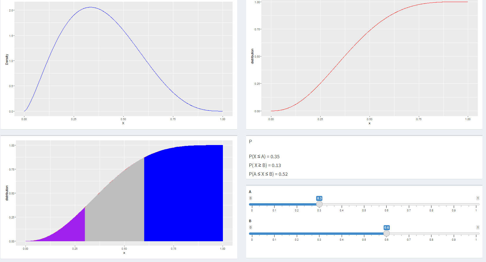

### Distributie Normala

```{r eval = FALSE}
if(input$dist == "norm"){
      show("alphaBeta")
      hide("oneParam")
      updateSliderInput(session, "alpha_", label = "Media",value=1, 
                        0, 100, 0.1
      )
      updateSliderInput(session, "beta_", label = "Deviatia standard", value=1,
                        0, 100, 0.1
      )
      
      updateSliderInput(session, "A", label = symbol("A"),value=0, 
                        0, 1, 0.1
      )
      updateSliderInput(session, "B", label = symbol("B"),value=0, 
                        0, 1, 0.1
      )
      
      # hide("alphaBeta")
      output$density<-renderPlot({
        x <- seq(0, 1, length = 1000)
        a <- input$alpha_
        b <- input$beta_
        density <- dnorm(x, mean = a, sd = b)
        ggplot() + 
          geom_line(aes(x=x,y=density), color="blue")+
          
          xlab("X") + ylab("Density")
      })
      
      
      output$distribution <-renderPlot({
        x <- seq(0, 1, length = 1000)
        a <- input$alpha_
        b <- input$beta_
        distribution <- pnorm(x, mean = a, sd = b)
        
        
        ggplot() +
          geom_line(aes(x=x, y=distribution), color = "red") +
          xlab("X") + ylab("Distribution")
        
      
      })
      output$distributionWithProb<-renderPlot({
        x <- seq(0, 1, length = 1000)
        a <- input$alpha_
        b <- input$beta_
        A <- input$A
        B <- input$B
        distribution <- pnorm(x, mean = a, sd = b)
        xs <- seq(0, A, by = 0.001)
        xs1 <- c(xs, seq(A, 0, by =-0.001))
        ys <- c(c(pnorm(xs, mean = a, sd= b)), seq(0,0,length = length(xs)))
        
        xt <- seq(B, 1, by = 0.001)
        xt1 <- c(xt, seq(1, B, by = -0.001))
        yt <- c(c(pnorm(xt, mean = a, sd= b)), seq(0,0,length = length(xt)))
        
        
        xf <- seq(A, B, by =0.001)
        xf1 <- c(xf, seq(B, A, by =-0.001))
        yf <- c(c(pnorm(xf, mean = a, sd = b)), seq(0,0, length = length(xf)))
        polygon(xf1, yf, col = "blue")
        

        
        
        output$P1<-renderText(paste0(HTML("P(X ≤ A) = "), round(pnorm(A, mean = a, sd = b), digits = 2)))
        output$P2<-renderText(paste0(HTML("P( X ≥ B) = "), round(1 - pnorm(B, mean = a, sd = b), digits = 2)))
        output$P3<-renderText(paste0(HTML("P(A ≤ X ≤ B) = "), round(pnorm(B, mean = a, sd = b) - pnorm(A, mean = a, sd = b), digits= 2)))
        
        
        ggplot() +
          geom_line(aes(x=x, y=distribution), color = "red")+
          geom_polygon(aes(x= xs1, y=ys), colour = "purple", fill="purple")+
          geom_polygon(aes(x= xt1, y=yt), colour = "blue", fill="blue")+
          geom_polygon(aes(x= xf1, y=yf), colour = "grey", fill="grey")
      })
    }
      
    
   
```

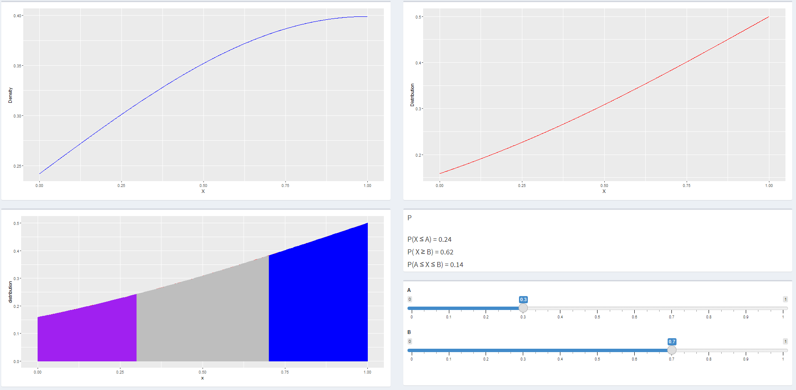

### Distribuie Uniforma

```{r eval = FALSE}

    if(input$dist == "unif"){
      show("alphaBeta")
      hide("oneParam")
      updateSliderInput(session, "alpha_", label = "Min",value=0.5, 
                        0, 1, 0.01
      )
      updateSliderInput(session, "beta_", label = "Max", value=0.7,
                        0, 1, 0.01
      )
      updateSliderInput(session, "A", label = symbol("A"),value=0, 
                        0, 1, 0.1
      )
      updateSliderInput(session, "B", label = symbol("B"),value=0, 
                        0, 1, 0.1
      )
      # hide("alphaBeta")
      output$density<-renderPlot({
        x <- seq(0, 1, length = 1000)
        a <- input$alpha_
        b <- input$beta_
        density <- dunif(x, min = a,  max = b, log = FALSE)
        ggplot() + 
          geom_line(aes(x=x,y=density), color="blue")+
          
          xlab("X") + ylab("Density")
      })
      
      
      output$distribution <-renderPlot({
        x <- seq(0, 1, length = 1000)
        a <- input$alpha_
        b <- input$beta_
        distribution <- punif(x, min = a, max = b)
        
        
        ggplot() +
          geom_line(aes(x=x, y=distribution), color = "red") +
          xlab("X") + ylab("Distribution")
        
        
      })
      output$distributionWithProb<-renderPlot({
        x <- seq(0, 1, length = 1000)
        a <- input$alpha_
        b <- input$beta_
        A <- input$A
        B <- input$B
        distribution <- punif(x, min = a, max = b)
        
        xs <- seq(0, A, by = 0.01)
        xs1 <- c(xs, seq(A, 0, by =-0.01))
        ys <- c(c(punif(xs, min = a, max= b)), seq(0,0,length = length(xs)))
        
        xt <- seq(B, 1, by = 0.01)
        xt1 <- c(xt, seq(1, B, by = -0.01))
        yt <- c(c(punif(xt, min = a, max= b)), seq(0,0,length = length(xt)))
        
        
        xf <- seq(A, B, by =0.01)
        xf1 <- c(xf, seq(B, A, by =-0.01))
        yf <- c(c(punif(xf, min = a, max = b)), seq(0,0, length = length(xf)))
        polygon(xf1, yf, col = "blue")
        
        
        
        
        output$P1<-renderText(paste0(HTML("P(X ≤ A) = "), round(punif(A, min = a, max = b), digits = 2)))
        output$P2<-renderText(paste0(HTML("P( X ≥ B) = "), round(1 - punif(B, min = a, max = b), digits = 2)))
        output$P3<-renderText(paste0(HTML("P(A ≤ X ≤ B) = "), round(punif(B, min = a, max = b) - punif(A, min = a, max = b), digits= 2)))
        
        
        ggplot() +
          geom_line(aes(x=x, y=distribution), color = "red", size=2)+
          geom_polygon(aes(x= xs1, y=ys), colour = "purple", fill="purple")+
          geom_polygon(aes(x= xt1, y=yt), colour = "blue", fill="blue")+
          geom_polygon(aes(x= xf1, y=yf), colour = "grey", fill="grey")
      })
    
    
    }


```

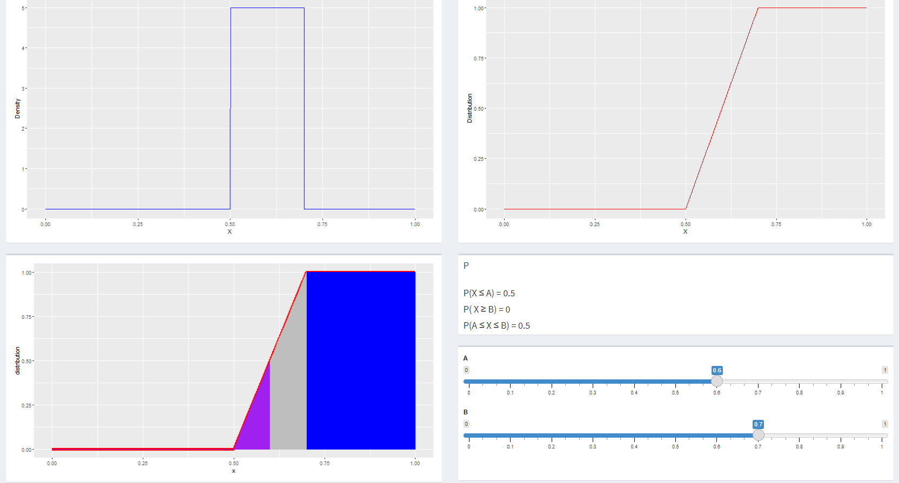

### Distributie Exponentiala

```{r eval = FALSE}
if(input$dist == "exp"){
      # show("alphaBeta")
      hide("alphaBeta")
      show("oneParam")
      updateSliderInput(session, "alphaS_", label = "Lambda",value=10, 
                        0, 100, 0.01
      )
      
      updateSliderInput(session, "A", label = symbol("A"),value=0, 
                        0, 1, 0.1
      )
      updateSliderInput(session, "B", label = symbol("B"),value=1, 
                        0, 1, 0.1
      )
      
      # hide("alphaBeta")
      output$density<-renderPlot({
        x <- seq(0, 1, length = 1000)
        a <- input$alphaS_
        density <- dexp(x, rate = a, log = FALSE)
        ggplot() + 
          geom_line(aes(x=x,y=density), color="blue")+
          
          xlab("X") + ylab("Density")
      })
      
      
      output$distribution <-renderPlot({
        x <- seq(0, 1, length = 1000)
        a <- input$alphaS_
        distribution <- pexp(x, rate = a, log = FALSE)
        
        
        ggplot() +
          geom_line(aes(x=x, y=distribution), color = "red") +
          xlab("X") + ylab("Distribution")
        
        
      })
      output$distributionWithProb<-renderPlot({
        x <- seq(0, 1, length = 1000)
        a <- input$alphaS_
        A <- input$A
        B <- input$B
        distribution <- pexp(x, rate = a)
        
        xs <- seq(0, A, by = 0.01)
        xs1 <- c(xs, seq(A, 0, by =-0.01))
        ys <- c(c(pexp(xs, rate = a)), seq(0,0,length = length(xs)))
        
        xt <- seq(B, 1, by = 0.01)
        xt1 <- c(xt, seq(1, B, by = -0.01))
        yt <- c(c(pexp(xt, rate = a)), seq(0,0,length = length(xt)))
        
        
        xf <- seq(A, B, by =0.01)
        xf1 <- c(xf, seq(B, A, by =-0.01))
        yf <- c(c(pexp(xf, rate = a)), seq(0,0, length = length(xf)))
        polygon(xf1, yf, col = "blue")
        
        
        
        
        output$P1<-renderText(paste0(HTML("P(X ≤ A) = "), round(pexp(A, rate = a), digits = 2)))
        output$P2<-renderText(paste0(HTML("P( X ≥ B) = "), round(1 - pexp(B, rate = a), digits = 2)))
        output$P3<-renderText(paste0(HTML("P(A ≤ X ≤ B) = "), round(pexp(B, rate = a) - pexp(A, rate = a), digits= 2)))
        
        
        ggplot() +
          geom_line(aes(x=x, y=distribution), color = "red", size=2)+
          geom_polygon(aes(x= xs1, y=ys), colour = "purple", fill="purple")+
          geom_polygon(aes(x= xt1, y=yt), colour = "blue", fill="blue")+
          geom_polygon(aes(x= xf1, y=yf), colour = "grey", fill="grey")
      })
      
      
    }
    
    
```

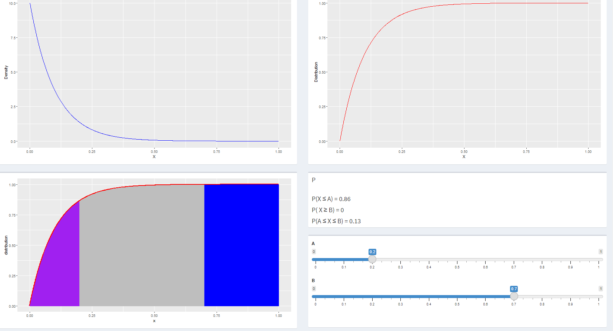

### Distributie Poisson

```{r eval=FALSE}
    if(input$dist == "pois"){
      # show("alphaBeta")
      hide("alphaBeta")
      show("oneParam")
      updateSliderInput(session, "alphaS_", label = "Lambda",value=0.5, 
                        0, 1, 0.01
      )
      
      updateSliderInput(session, "A", label = symbol("A"),value=1, 
                        0, 10, 1
      )
      updateSliderInput(session, "B", label = symbol("B"),value=1, 
                        0, 10, 1
      )
      
      # hide("alphaBeta")
      output$density<-renderPlot({
        x <- seq(0, 16, by=1)
        a <- input$alphaS_
        density <- dpois(x, lambda = a, log = FALSE)
        ggplot() + 
          geom_line(aes(x=x,y=density), color="blue")+
          
          xlab("X") + ylab("Density")
      })
      
      
      output$distribution <-renderPlot({
        x <- seq(0, 16, by = 1)
        a <- input$alphaS_
        distribution <- ppois(x, lambda = a, log = FALSE)
        
        
        ggplot() +
          geom_line(aes(x=x, y=distribution), color = "red") +
          xlab("X") + ylab("Distribution")
        
        
      })
      output$distributionWithProb<-renderPlot({
        x <- seq(0, 10, by=1)
        a <- input$alphaS_
        A <- input$A
        B <- input$B
        distribution <- ppois(x, lambda = a)
        
        xs <- seq(0, A, by = 1)
        xs1 <- c(xs, seq(A, 0, by = -1))
        ys <- c(c(ppois(xs, lambda = a)), seq(0,0,length = length(xs)))
        
        xt <- seq(B, 10, by = 1)
        xt1 <- c(xt, seq(10, B, by = -1))
        yt <- c(c(ppois(xt, lambda = a)), seq(0,0,length = length(xt)))
        
        
        xf <- seq(A, B, by = 1)
        xf1 <- c(xf, seq(B, A, by = -1))
        yf <- c(c(ppois(xf, lambda = a)), seq(0,0, length = length(xf)))
        polygon(xf1, yf, col = "blue")
        
        
        
        
        output$P1<-renderText(paste0(HTML("P(X ≤ A) = "), round(ppois(A, lambda = a), digits = 2)))
        output$P2<-renderText(paste0(HTML("P( X ≥ B) = "), round(1 - ppois(B, lambda = a), digits = 2)))
        output$P3<-renderText(paste0(HTML("P(A ≤ X ≤ B) = "), round(ppois(B, lambda = a) - pexp(A, rate = a), digits= 2)))
        
        
        ggplot() +
          geom_point(aes(x=x, y=distribution), color = "red", size=2)+
          geom_polygon(aes(x= xs1, y=ys), colour = "purple", fill="purple")+
          geom_polygon(aes(x= xt1, y=yt), colour = "blue", fill="blue")+
          geom_polygon(aes(x= xf1, y=yf), colour = "grey", fill="grey")
      })
      
      
    }
```

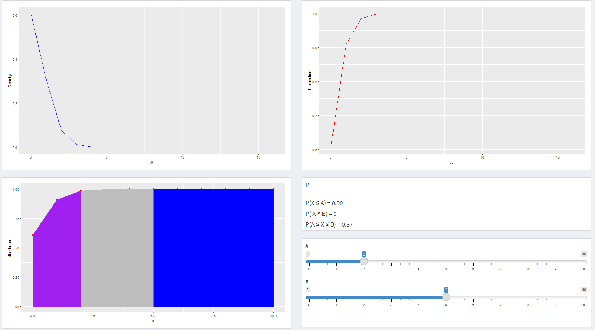

### Distributie Binomiala

```{r eval=FALSE}
if(input$dist == "binom"){
      show("alphaBeta")
      hide("oneParam")
      
      updateSliderInput(session, "alpha_", label = "Repetari",value=50, 
                        0, 100, 1
      )
      updateSliderInput(session, "beta_", label = "Probabilitate", value=0.5,
                        0, 1, 0.1
      )
      
      updateSliderInput(session, "A", label = symbol("A"),value=1, 
                        0, 100, 1
      )
      updateSliderInput(session, "B", label = symbol("B"),value=1, 
                        0, 100, 1
      )
      
      
      
      # hide("alphaBeta")
      output$density<-renderPlot({
        x <- seq(0, 100, by = 1)
        a <- input$alpha_
        b <- input$beta_
        density <- dbinom(x, size = a,  prob = b, log = FALSE)
        ggplot() + 
          geom_line(aes(x=x,y=density), color="blue")+
          
          xlab("X") + ylab("Density")
      })
      
      
      output$distribution <-renderPlot({
        x <- seq(0, 100, by = 1)
        a <- input$alpha_
        b <- input$beta_
        distribution <- pbinom(x, size = a, prob = b)
        
        
        ggplot() +
          geom_line(aes(x=x, y=distribution), color = "red") +
          xlab("X") + ylab("Distribution")
        
        
      })
      output$distributionWithProb<-renderPlot({
        x <- seq(0, 100, by = 1)
        a <- input$alpha_
        b <- input$beta_
        A <- input$A
        B <- input$B
        distribution <- pbinom(x, size = a, prob = b)
        
        xs <- seq(0, A, by = 1)
        xs1 <- c(xs, seq(A, 0, by =-1))
        ys <- c(c(pbinom(xs, size = a, prob= b)), seq(0,0,length = length(xs)))
        
        xt <- seq(B, 100, by = 1)
        xt1 <- c(xt, seq(100, B, by = -1))
        yt <- c(c(pbinom(xt, size = a, prob= b)), seq(0,0,length = length(xt)))
        
        
        xf <- seq(A, B, by =1)
        xf1 <- c(xf, seq(B, A, by =-1))
        yf <- c(c(pbinom(xf, size = a, prob = b)), seq(0,0, length = length(xf)))
        polygon(xf1, yf, col = "blue")
        
        
        
        
        output$P1<-renderText(paste0(HTML("P(X ≤ A) = "), pbinom(A, size = a, prob = b)))
        output$P2<-renderText(paste0(HTML("P( X ≥ B) = "), 1 - pbinom(B, size = a, prob = b)))
        output$P3<-renderText(paste0(HTML("P(A ≤ X ≤ B) = "), pbinom(B, size = a, prob = b) - pbinom(A, size = a, prob = b)))
        
        
        ggplot() +
          geom_line(aes(x=x, y=distribution), color = "red", size=2)+
          geom_polygon(aes(x= xs1, y=ys), colour = "purple", fill="purple")+
          geom_polygon(aes(x= xt1, y=yt), colour = "blue", fill="blue")+
          geom_polygon(aes(x= xf1, y=yf), colour = "grey", fill="grey")
      })
      
      
    }
```

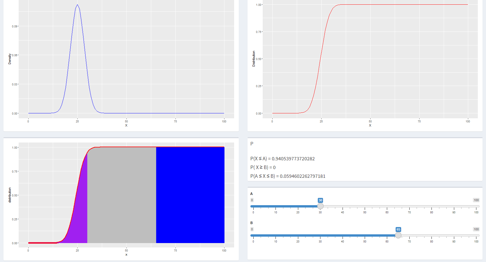

### Repartitia Geometrica

```{r eval=FALSE}
if(input$dist == "geom"){
      # show("alphaBeta")
      hide("alphaBeta")
      show("oneParam")
      updateSliderInput(session, "alphaS_", label = "Probabilitatea",value=0.2, 
                        0, 1, 0.01
      )
      
      updateSliderInput(session, "A", label = symbol("A"),value=18, 
                        0, 100, 1
      )
      updateSliderInput(session, "B", label = symbol("B"),value=45, 
                        0, 100, 1
      )
      
      # hide("alphaBeta")
      output$density<-renderPlot({
        x <- seq(0, 100, by = 1)
        a <- input$alphaS_
        density <- dgeom(x, prob = a, log = FALSE)
        ggplot() + 
          geom_line(aes(x=x,y=density), color="blue")+
          
          xlab("X") + ylab("Density")
      })
      
      
      output$distribution <-renderPlot({
        x <- seq(0, 100, by = 1)
        a <- input$alphaS_
        distribution <- pgeom(x, prob = a, log = FALSE)
        
        
        ggplot() +
          geom_line(aes(x=x, y=distribution), color = "red") +
          xlab("X") + ylab("Distribution")
        
        
      })
      output$distributionWithProb<-renderPlot({
        x <- seq(0, 100, by = 1)
        a <- input$alphaS_
        A <- input$A
        B <- input$B
        distribution <- pgeom(x, prob = a)
        
        xs <- seq(0, A, by = 1)
        xs1 <- c(xs, seq(A, 0, by = -1))
        ys <- c(c(pgeom(xs, prob = a)), seq(0,0,length = length(xs)))
        
        xt <- seq(B, 100, by = 1)
        xt1 <- c(xt, seq(100, B, by = -1))
        yt <- c(c(pgeom(xt, prob = a)), seq(0,0,length = length(xt)))
        
       
        xf <- seq(A, B, by = 1)
        xf1 <- c(xf, seq(B, A, by = -1))
        yf <- c(c(pgeom(xf, prob = a)), seq(0,0, length = length(xf)))
        polygon(xf1, yf, col = "blue")
        
        
        
        
        output$P1<-renderText(paste0(HTML("P(X ≤ A) = "), round(pgeom(A, prob = a), digits = 10)))
        output$P2<-renderText(paste0(HTML("P( X ≥ B) = "), round(1 - pgeom(B, prob = a), digits = 10)))
        output$P3<-renderText(paste0(HTML("P(A ≤ X ≤ B) = "), round(pgeom(B, prob = a) - pgeom(A, prob = a), digits= 10)))
        
        
        ggplot() +
          geom_line(aes(x=x, y=distribution), color = "red", size=2)+
          geom_polygon(aes(x= xs1, y=ys), colour = "purple", fill="purple")+
          geom_polygon(aes(x= xt1, y=yt), colour = "blue", fill="blue")+
          geom_polygon(aes(x= xf1, y=yf), colour = "grey", fill="grey")
      

      })
      
      
    }
```

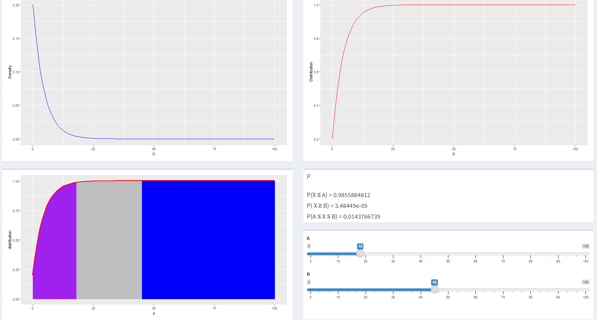

### Distributia Cauchy

```{r eval=FALSE}
if(input$dist == "cauchy"){
      show("alphaBeta")
      hide("oneParam")
      
      # strict pozitiv
      updateSliderInput(session, "alpha_", label = "Locatie",value=30, 
                        0.1, 50, 0.1
      )
      
      updateSliderInput(session, "beta_", label = "Scara(Scale)", value=8,
                        0, 10, 1
      )
      
      updateSliderInput(session, "A", label = symbol("A"),value=1, 
                        0, 100, 1
      )
      updateSliderInput(session, "B", label = symbol("B"),value=1, 
                        0, 100, 1
      )
      
      
      
      # hide("alphaBeta")
      output$density<-renderPlot({
        x <- seq(0, 100, by = 1)
        a <- input$alpha_
        b <- input$beta_
        density <- dcauchy(x, location = a,  scale = b, log = FALSE)
        ggplot() + 
          geom_line(aes(x=x,y=density), color="blue")+
          
          xlab("X") + ylab("Density")
      })
      
      
      output$distribution <-renderPlot({
        x <- seq(0, 100, by = 1)
        a <- input$alpha_
        b <- input$beta_
        distribution <- pcauchy(x, location = a, scale = b)
        
        
        ggplot() +
          geom_line(aes(x=x, y=distribution), color = "red") +
          xlab("X") + ylab("Distribution")
        
        
      })
      output$distributionWithProb<-renderPlot({
        x <- seq(0, 100, by = 1)
        a <- input$alpha_
        b <- input$beta_
        A <- input$A
        B <- input$B
        distribution <- pcauchy(x, location = a, scale = b)
        
        xs <- seq(0, A, by = 1)
        xs1 <- c(xs, seq(A, 0, by =-1))
        ys <- c(c(pcauchy(xs, location = a, scale= b)), seq(0,0,length = length(xs)))
        
        xt <- seq(B, 100, by = 1)
        xt1 <- c(xt, seq(100, B, by = -1))
        yt <- c(c(pcauchy(xt, location = a, scale= b)), seq(0,0,length = length(xt)))
        
        
        xf <- seq(A, B, by =1)
        xf1 <- c(xf, seq(B, A, by =-1))
        yf <- c(c(pcauchy(xf, location = a, scale = b)), seq(0,0, length = length(xf)))
        polygon(xf1, yf, col = "blue")
        
        
        
        
        output$P1<-renderText(paste0(HTML("P(X ≤ A) = "), pcauchy(A, location = a, scale = b)))
        output$P2<-renderText(paste0(HTML("P( X ≥ B) = "), 1 - pcauchy(B, location = a, scale = b)))
        output$P3<-renderText(paste0(HTML("P(A ≤ X ≤ B) = "), pcauchy(B, location = a, scale = b) - pcauchy(A, location = a, scale = b)))
        
        
        ggplot() +
          geom_line(aes(x=x, y=distribution), color = "red", size=2)+
          geom_polygon(aes(x= xs1, y=ys), colour = "purple", fill="purple")+
          geom_polygon(aes(x= xt1, y=yt), colour = "blue", fill="blue")+
          geom_polygon(aes(x= xf1, y=yf), colour = "grey", fill="grey")
      })
      
      
    }
```

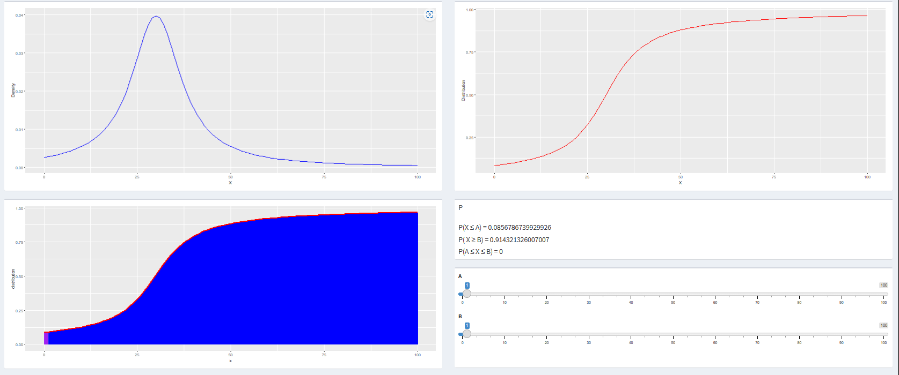

### Distribuitia F

```{r eval=FALSE}
  if(input$dist == "f"){
      show("alphaBeta")
      hide("oneParam")
      
      updateSliderInput(session, "alpha_", label = "Gradul 1 de libertate",value=1, 
                        0.1, 100, 0.1
      )
      updateSliderInput(session, "beta_", label = "Gradul 2 de libertate", value=1,
                        0.1, 100, 0.1
      )
      
      updateSliderInput(session, "A", label = symbol("A"),value=1, 
                        0, 100, 1
      )
      updateSliderInput(session, "B", label = symbol("B"),value=1, 
                        0, 100, 1
      )
      
      
      
      # hide("alphaBeta")
      output$density<-renderPlot({
        x <- seq(0, 100, by = 1)
        a <- input$alpha_
        b <- input$beta_
        density <- df(x, df1 = a,  df2 = b, log = FALSE)
        ggplot() + 
          geom_line(aes(x=x,y=density), color="blue")+
          
          xlab("X") + ylab("Density")
      })
      
      
      output$distribution <-renderPlot({
        x <- seq(0, 100, by = 1)
        a <- input$alpha_
        b <- input$beta_
        distribution <- pf(x, df1 = a, df2 = b)
        
        
        ggplot() +
          geom_line(aes(x=x, y=distribution), color = "red") +
          xlab("X") + ylab("Distribution")
        
        
      })
      output$distributionWithProb<-renderPlot({
        x <- seq(0, 100, by = 1)
        a <- input$alpha_
        b <- input$beta_
        A <- input$A
        B <- input$B
        distribution <- pf(x, df1 = a, df2 = b)
        
        xs <- seq(0, A, by = 1)
        xs1 <- c(xs, seq(A, 0, by =-1))
        ys <- c(c(pf(xs, df1 = a, df2= b)), seq(0,0,length = length(xs)))
        
        xt <- seq(B, 100, by = 1)
        xt1 <- c(xt, seq(100, B, by = -1))
        yt <- c(c(pf(xt, df1 = a, df2= b)), seq(0,0,length = length(xt)))
        
        
        xf <- seq(A, B, by =1)
        xf1 <- c(xf, seq(B, A, by =-1))
        yf <- c(c(pf(xf, df1 = a, df2 = b)), seq(0,0, length = length(xf)))
        polygon(xf1, yf, col = "blue")
        
        
        
        
        output$P1<-renderText(paste0(HTML("P(X ≤ A) = "), pf(A, df1 = a, df2 = b)))
        output$P2<-renderText(paste0(HTML("P( X ≥ B) = "), 1 - pf(B, df1 = a, df2 = b)))
        output$P3<-renderText(paste0(HTML("P(A ≤ X ≤ B) = "), pf(B, df = a, df2 = b) - pf(A, df1 = a, df2 = b)))
        
        
        ggplot() +
          geom_line(aes(x=x, y=distribution), color = "red", size=2)+
          geom_polygon(aes(x= xs1, y=ys), colour = "purple", fill="purple")+
          geom_polygon(aes(x= xt1, y=yt), colour = "blue", fill="blue")+
          geom_polygon(aes(x= xf1, y=yf), colour = "grey", fill="grey")
      })
      
      
    }
    
```


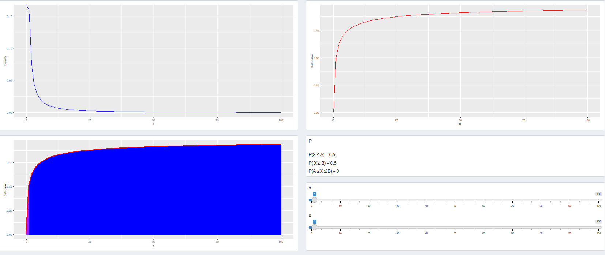

### Distributia t

```{r eval=FALSE}
    
    if(input$dist == "t"){
      show("alphaBeta")
      hide("oneParam")
      
      # strict pozitiv
      updateSliderInput(session, "alpha_", label = "Gradul de libertate",value=1, 
                        0.1, 25, 0.1
      )
      # mai mica decat 37 (abs(ncp)<=37.62)
      updateSliderInput(session, "beta_", label = "Centralitatea", value=1,
                        0, 37, 1
      )
      
      updateSliderInput(session, "A", label = symbol("A"),value=1, 
                        0, 100, 1
      )
      updateSliderInput(session, "B", label = symbol("B"),value=1, 
                        0, 100, 1
      )
      
      
      
      # hide("alphaBeta")
      output$density<-renderPlot({
        x <- seq(0, 100, by = 1)
        a <- input$alpha_
        b <- input$beta_
        density <- dt(x, df = a,  ncp = b, log = FALSE)
        ggplot() + 
          geom_line(aes(x=x,y=density), color="blue")+
          
          xlab("X") + ylab("Density")
      })
      
      
      output$distribution <-renderPlot({
        x <- seq(0, 100, by = 1)
        a <- input$alpha_
        b <- input$beta_
        distribution <- pt(x, df = a, ncp = b)
        
        
        ggplot() +
          geom_line(aes(x=x, y=distribution), color = "red") +
          xlab("X") + ylab("Distribution")
        
        
      })
      output$distributionWithProb<-renderPlot({
        x <- seq(0, 100, by = 1)
        a <- input$alpha_
        b <- input$beta_
        A <- input$A
        B <- input$B
        distribution <- pt(x, df = a, ncp = b)
        
        xs <- seq(0, A, by = 1)
        xs1 <- c(xs, seq(A, 0, by =-1))
        ys <- c(c(pt(xs, df = a, ncp= b)), seq(0,0,length = length(xs)))
        
        xt <- seq(B, 100, by = 1)
        xt1 <- c(xt, seq(100, B, by = -1))
        yt <- c(c(pt(xt, df = a, ncp= b)), seq(0,0,length = length(xt)))
        
        
        xf <- seq(A, B, by =1)
        xf1 <- c(xf, seq(B, A, by =-1))
        yf <- c(c(pt(xf, df = a, ncp = b)), seq(0,0, length = length(xf)))
        polygon(xf1, yf, col = "blue")
        
        
        
        
        output$P1<-renderText(paste0(HTML("P(X ≤ A) = "), pt(A, df = a, ncp = b)))
        output$P2<-renderText(paste0(HTML("P( X ≥ B) = "), 1 - pt(B, df = a, ncp = b)))
        output$P3<-renderText(paste0(HTML("P(A ≤ X ≤ B) = "), pt(B, df = a, ncp = b) - pt(A, df = a, ncp = b)))
        
        
        ggplot() +
          geom_line(aes(x=x, y=distribution), color = "red", size=2)+
          geom_polygon(aes(x= xs1, y=ys), colour = "purple", fill="purple")+
          geom_polygon(aes(x= xt1, y=yt), colour = "blue", fill="blue")+
          geom_polygon(aes(x= xf1, y=yf), colour = "grey", fill="grey")
      })
      
      
    }
```

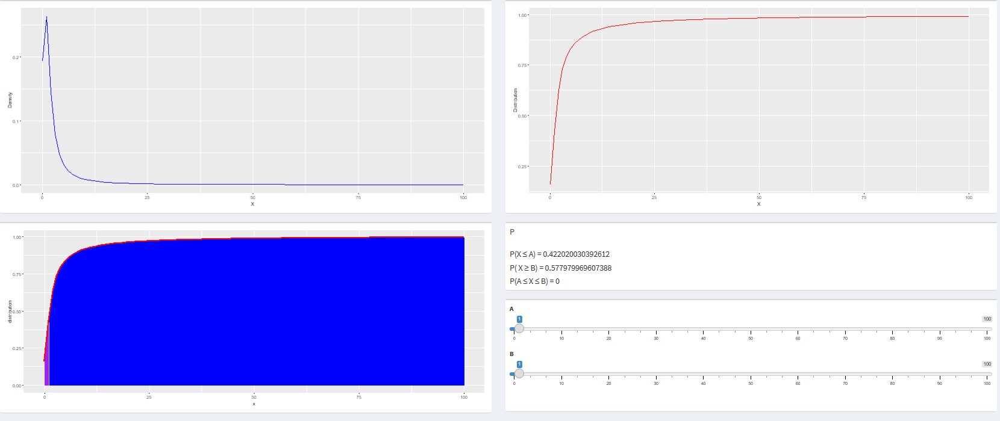

### Distributia Chi-Squared

```{r eval=FALSE}
if(input$dist == "chisq"){
      show("alphaBeta")
      hide("oneParam")
      
      updateSliderInput(session, "alpha_", label = "Gradul de libertate",value=1, 
                        0.1, 25, 0.1
      )
      updateSliderInput(session, "beta_", label = "Non-centralitatea", value=1,
                        0, 10, 1
      )
      
      updateSliderInput(session, "A", label = symbol("A"),value=1, 
                        0, 100, 1
      )
      updateSliderInput(session, "B", label = symbol("B"),value=1, 
                        0, 100, 1
      )
      
      
      
      # hide("alphaBeta")
      output$density<-renderPlot({
        x <- seq(0, 100, by = 1)
        a <- input$alpha_
        b <- input$beta_
        density <- dchisq(x, df = a,  ncp = b, log = FALSE)
        ggplot() + 
          geom_line(aes(x=x,y=density), color="blue")+
          
          xlab("X") + ylab("Density")
      })
      
      
      output$distribution <-renderPlot({
        x <- seq(0, 100, by = 1)
        a <- input$alpha_
        b <- input$beta_
        distribution <- pchisq(x, df = a, ncp = b)
        
        
        ggplot() +
          geom_line(aes(x=x, y=distribution), color = "red") +
          xlab("X") + ylab("Distribution")
        
        
      })
      output$distributionWithProb<-renderPlot({
        x <- seq(0, 100, by = 1)
        a <- input$alpha_
        b <- input$beta_
        A <- input$A
        B <- input$B
        distribution <- pchisq(x, df = a, ncp = b)
        
        xs <- seq(0, A, by = 1)
        xs1 <- c(xs, seq(A, 0, by =-1))
        ys <- c(c(pchisq(xs, df = a, ncp= b)), seq(0,0,length = length(xs)))
        
        xt <- seq(B, 100, by = 1)
        xt1 <- c(xt, seq(100, B, by = -1))
        yt <- c(c(pchisq(xt, df = a, ncp= b)), seq(0,0,length = length(xt)))
        
        
        xf <- seq(A, B, by =1)
        xf1 <- c(xf, seq(B, A, by =-1))
        yf <- c(c(pchisq(xf, df = a, ncp = b)), seq(0,0, length = length(xf)))
        polygon(xf1, yf, col = "blue")
        
        
        
        
        output$P1<-renderText(paste0(HTML("P(X ≤ A) = "), pchisq(A, df = a, ncp = b)))
        output$P2<-renderText(paste0(HTML("P( X ≥ B) = "), 1 - pchisq(B, df = a, ncp = b)))
        output$P3<-renderText(paste0(HTML("P(A ≤ X ≤ B) = "), pchisq(B, df = a, ncp = b) - pchisq(A, df = a, ncp = b)))
        
        
        ggplot() +
          geom_line(aes(x=x, y=distribution), color = "red", size=2)+
          geom_polygon(aes(x= xs1, y=ys), colour = "purple", fill="purple")+
          geom_polygon(aes(x= xt1, y=yt), colour = "blue", fill="blue")+
          geom_polygon(aes(x= xf1, y=yf), colour = "grey", fill="grey")
      })
      
      
    }
```

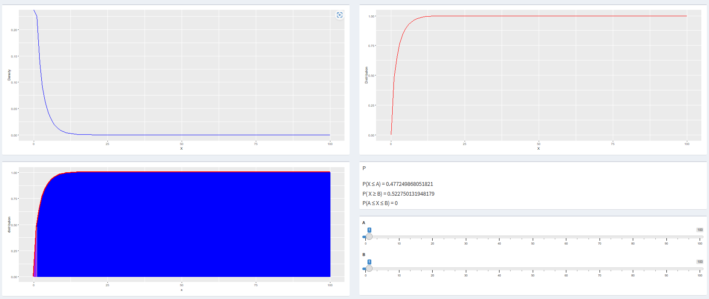

### Distributia Log-Normal

```{r eval=FALSE}


    if(input$dist == "lnorm"){
      show("alphaBeta")
      hide("oneParam")
      
      updateSliderInput(session, "alpha_", label = "Media log",value=6, 
                        0.1, 10, 0.01
      )
      updateSliderInput(session, "beta_", label = "Deviatia standard log", value=2.2,
                        0.1, 10, 0.01
      )
      
      updateSliderInput(session, "A", label = symbol("A"),value=1, 
                        0, 100, 1
      )
      updateSliderInput(session, "B", label = symbol("B"),value=1, 
                        0, 100, 1
      )
      
      
      
      # hide("alphaBeta")
      output$density<-renderPlot({
        x <- seq(0, 100, by = 1)
        a <- input$alpha_
        b <- input$beta_
        density <- dlnorm(x, meanlog = a,  sdlog = b, log = FALSE)
        ggplot() + 
          geom_line(aes(x=x,y=density), color="blue")+
          
          xlab("X") + ylab("Density")
      })
      
      
      output$distribution <-renderPlot({
        x <- seq(0, 100, by = 1)
        a <- input$alpha_
        b <- input$beta_
        distribution <- plnorm(x, meanlog = a, sdlog = b)
        
        
        ggplot() +
          geom_line(aes(x=x, y=distribution), color = "red") +
          xlab("X") + ylab("Distribution")
        
        
      })
      output$distributionWithProb<-renderPlot({
        x <- seq(0, 100, by = 1)
        a <- input$alpha_
        b <- input$beta_
        A <- input$A
        B <- input$B
        distribution <- plnorm(x, meanlog = a, sdlog = b)
        
        xs <- seq(0, A, by = 1)
        xs1 <- c(xs, seq(A, 0, by =-1))
        ys <- c(c(plnorm(xs, meanlog = a, sdlog= b)), seq(0,0,length = length(xs)))
        
        xt <- seq(B, 100, by = 1)
        xt1 <- c(xt, seq(100, B, by = -1))
        yt <- c(c(plnorm(xt, meanlog = a, sdlog= b)), seq(0,0,length = length(xt)))
        
        
        xf <- seq(A, B, by =1)
        xf1 <- c(xf, seq(B, A, by =-1))
        yf <- c(c(plnorm(xf, meanlog = a, sdlog = b)), seq(0,0, length = length(xf)))
        polygon(xf1, yf, col = "blue")
        
        
        
        
        output$P1<-renderText(paste0(HTML("P(X ≤ A) = "), plnorm(A, meanlog = a, sdlog = b)))
        output$P2<-renderText(paste0(HTML("P( X ≥ B) = "), 1 - plnorm(B, meanlog = a, sdlog = b)))
        output$P3<-renderText(paste0(HTML("P(A ≤ X ≤ B) = "), plnorm(B, meanlog = a, sdlog = b) - plnorm(A, meanlog = a, sdlog = b)))
        
        
        ggplot() +
          geom_line(aes(x=x, y=distribution), color = "red", size=2)+
          geom_polygon(aes(x= xs1, y=ys), colour = "purple", fill="purple")+
          geom_polygon(aes(x= xt1, y=yt), colour = "blue", fill="blue")+
          geom_polygon(aes(x= xf1, y=yf), colour = "grey", fill="grey")
      })
      
      
    }

```

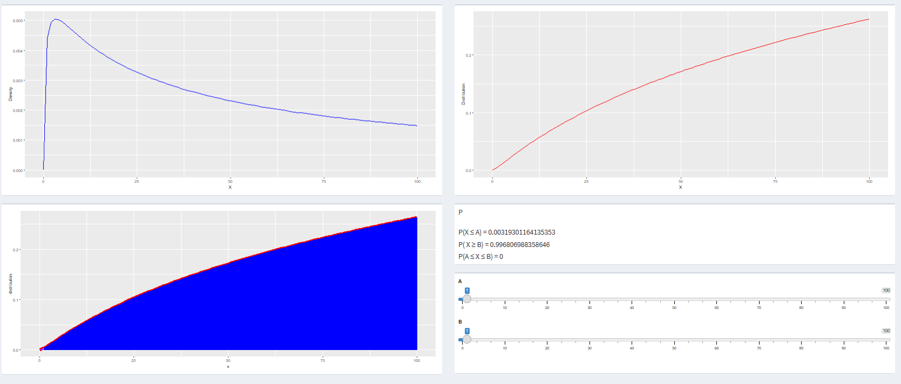

### Distributia Weibull

```{r eval=FALSE}
if(input$dist == "weibull"){
      show("alphaBeta")
      hide("oneParam")
      
      updateSliderInput(session, "alpha_", label = "Forma",value=2, 
                        0, 50, 1
      )
      updateSliderInput(session, "beta_", label = "Scale", value=18,
                        0.1, 25, 0.1
      )
      
      updateSliderInput(session, "A", label = symbol("A"),value=1, 
                        0, 100, 1
      )
      updateSliderInput(session, "B", label = symbol("B"),value=1, 
                        0, 100, 1
      )
      
      
      
      # hide("alphaBeta")
      output$density<-renderPlot({
        x <- seq(0, 100, by = 1)
        a <- input$alpha_
        b <- input$beta_
        density <- dweibull(x, shape = a,  scale = b, log = FALSE)
        ggplot() + 
          geom_line(aes(x=x,y=density), color="blue")+
          
          xlab("X") + ylab("Density")
      })
      
      
      output$distribution <-renderPlot({
        x <- seq(0, 100, by = 1)
        a <- input$alpha_
        b <- input$beta_
        distribution <- pweibull(x, shape = a, scale = b)
        
        
        ggplot() +
          geom_line(aes(x=x, y=distribution), color = "red") +
          xlab("X") + ylab("Distribution")
        
        
      })
      output$distributionWithProb<-renderPlot({
        x <- seq(0, 100, by = 1)
        a <- input$alpha_
        b <- input$beta_
        A <- input$A
        B <- input$B
        distribution <- pweibull(x, shape = a, scale = b)
        
        xs <- seq(0, A, by = 1)
        xs1 <- c(xs, seq(A, 0, by =-1))
        ys <- c(c(pweibull(xs, shape = a, scale= b)), seq(0,0,length = length(xs)))
        
        xt <- seq(B, 100, by = 1)
        xt1 <- c(xt, seq(100, B, by = -1))
        yt <- c(c(pweibull(xt, shape = a, scale= b)), seq(0,0,length = length(xt)))
        
        
        xf <- seq(A, B, by =1)
        xf1 <- c(xf, seq(B, A, by =-1))
        yf <- c(c(pweibull(xf, shape = a, scale = b)), seq(0,0, length = length(xf)))
        polygon(xf1, yf, col = "blue")
        
        
        
        
        output$P1<-renderText(paste0(HTML("P(X ≤ A) = "), pweibull(A, shape = a, scale = b)))
        output$P2<-renderText(paste0(HTML("P( X ≥ B) = "), 1 - pweibull(B, shape = a, scale = b)))
        output$P3<-renderText(paste0(HTML("P(A ≤ X ≤ B) = "), pweibull(B, shape = a, scale = b) - pweibull(A, shape = a, scale = b)))
        
        
        ggplot() +
          geom_line(aes(x=x, y=distribution), color = "red", size=2)+
          geom_polygon(aes(x= xs1, y=ys), colour = "purple", fill="purple")+
          geom_polygon(aes(x= xt1, y=yt), colour = "blue", fill="blue")+
          geom_polygon(aes(x= xf1, y=yf), colour = "grey", fill="grey")
      })
      
      
    }
```

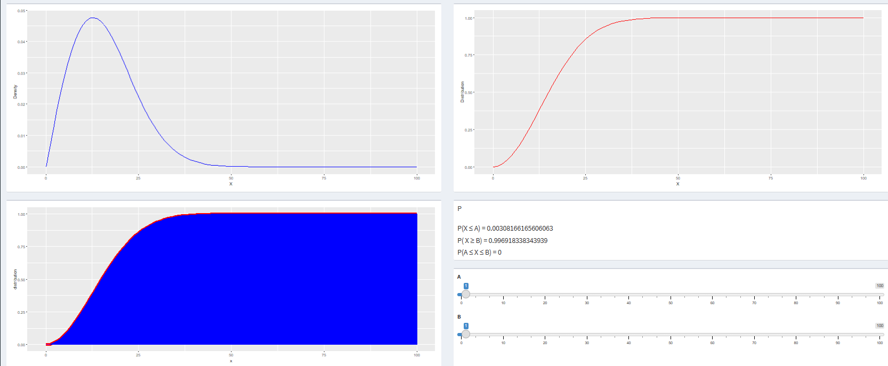

### Distributia Pareto

```{r eval=FALSE}
 if(input$dist == "pareto"){
      show("alphaBeta")
      hide("oneParam")
      
      updateSliderInput(session, "alpha_", label = "Locatie",value=2, 
                        0, 50, 1
      )
      updateSliderInput(session, "beta_", label = "Forma", value=20,
                        0, 25, 1
      )
      
      updateSliderInput(session, "A", label = symbol("A"),value=1, 
                        0, 100, 1
      )
      updateSliderInput(session, "B", label = symbol("B"),value=1, 
                        0, 100, 1
      )
      
      
      
      # hide("alphaBeta")
      output$density<-renderPlot({
        x <- seq(0, 100, by = 1)
        a <- input$alpha_
        b <- input$beta_
        density <- dpareto(x, shape = a,  scale = b, log = FALSE)
        ggplot() + 
          geom_line(aes(x=x,y=density), color="blue")+
          
          xlab("X") + ylab("Density")
      })
      
      
      output$distribution <-renderPlot({
        x <- seq(0, 100, by = 1)
        a <- input$alpha_
        b <- input$beta_
        distribution <- ppareto(x, shape = a, scale = b)
        
        
        ggplot() +
          geom_line(aes(x=x, y=distribution), color = "red") +
          xlab("X") + ylab("Distribution")
        
        
      })
      output$distributionWithProb<-renderPlot({
        x <- seq(0, 100, by = 1)
        a <- input$alpha_
        b <- input$beta_
        A <- input$A
        B <- input$B
        distribution <- ppareto(x, shape = a, scale = b)
        
        xs <- seq(0, A, by = 1)
        xs1 <- c(xs, seq(A, 0, by =-1))
        ys <- c(c(ppareto(xs, shape = a, scale= b)), seq(0,0,length = length(xs)))
        
        xt <- seq(B, 100, by = 1)
        xt1 <- c(xt, seq(100, B, by = -1))
        yt <- c(c(ppareto(xt, shape = a, scale= b)), seq(0,0,length = length(xt)))
        
        
        xf <- seq(A, B, by =1)
        xf1 <- c(xf, seq(B, A, by =-1))
        yf <- c(c(ppareto(xf, shape = a, scale = b)), seq(0,0, length = length(xf)))
        polygon(xf1, yf, col = "blue")
        
        
        
        
        output$P1<-renderText(paste0(HTML("P(X ≤ A) = "), ppareto(A, shape = a, scale = b)))
        output$P2<-renderText(paste0(HTML("P( X ≥ B) = "), 1 - ppareto(B, shape = a, scale = b)))
        output$P3<-renderText(paste0(HTML("P(A ≤ X ≤ B) = "), ppareto(B, shape = a, scale = b) - ppareto(A, shape = a, scale = b)))
        
        
        ggplot() +
          geom_line(aes(x=x, y=distribution), color = "red", size=2)+
          geom_polygon(aes(x= xs1, y=ys), colour = "purple", fill="purple")+
          geom_polygon(aes(x= xt1, y=yt), colour = "blue", fill="blue")+
          geom_polygon(aes(x= xf1, y=yf), colour = "grey", fill="grey")
      })
      
      
    }
    
    
    
    
    
  })
  
}
```

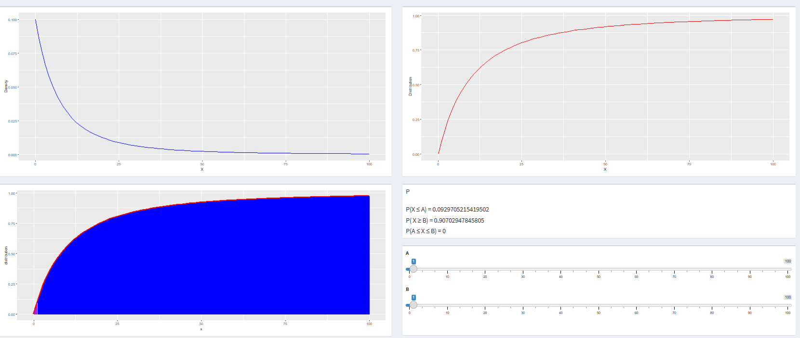{width="3458"}

## Including Plots

You can also embed plots, for example:

```{r pressure, echo=FALSE}
plot(pressure)
```

Note that the `echo = FALSE` parameter was added to the code chunk to
prevent printing of the R code that generated the plot.
